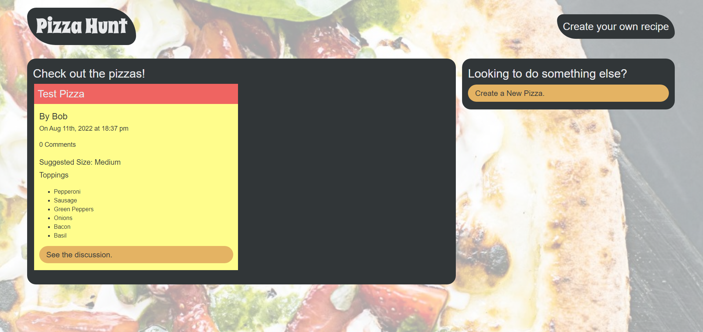

# pizza-hunt

- Github URL: https://github.com/DanielCConlon/pizza-hunt
- Heroku URL: Moving heroku deployment
<!-- https://secure-springs-96210.herokuapp.com/ -->

# Goal

This application was made following steps of a course module on MongoDB, MOngoose, MongoDB Atlas, and heroku. This app was created by adding back-end functionality to pre-exisiting front end code.

## Table-of-Contents

- [User Story](#userstory)
- [Description](#description)
- [Requirements](#Requirements)
- [Installation](#installation)
- [Usage](#usage)
- [Application](#application)
- [Questions](#questions)

## [User Story](#table-of-contents)

- AS A manager at an internet retail company
- I WANT a back end for my e-commerce website that uses the latest technologies
- SO THAT my company can compete with other e-commerce companies

## [Description](#table-of-contents)

Pizza-hunt is a social media app where users can post their own pizza recipes, add comments to other recipes, and create threads within those comments. This application was made
following steps of a course module on MongoDB, MOngoose, MongoDB Atlas, and heroku. This app was created by adding back-end functionality to pre-exisiting front end code.

## [Installation](#table-of-contents)

Download the repo from Github. You will also need to run the command npm install express mysql2 in order to get npm and mysql ready.

## [Usage](#table-of-contents)

When you first land on the pizza-hunt page you will see pizza recipes that have already been created. You can create your own pizza by clicking the create new pizza button or click the `see the discussion` button to see what others are saying about a recipe. While you are in the `see the discussion` page you can leave your own comments!

## [Application](#table-of-contents)

## [Questions](#table-of-contents)

To get into contact with me use the follow information below:
 
[Github: DanielCConlon](https://github.com/DanielCConlon)
 
[Email: danielcconlon@gmail.com](danielcconlon@gmail.com)
